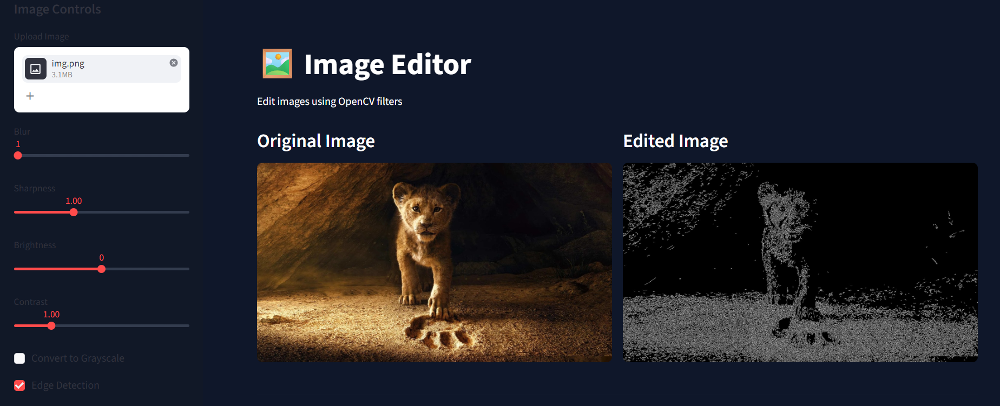

# 🖼️ Image Editor

This is a simple image editing web application built using Python, Streamlit, and OpenCV.

The project allows users to upload an image, apply filters like blur, brightness, contrast, grayscale, and edge detection, then download the edited image.

---

# 📌 Features

- Upload JPG / PNG images
- Blur filter
- Brightness adjustment
- Contrast adjustment
- Sharpness adjustment
- Grayscale conversion
- Edge detection
- Download edited image
- Reset filters

---

# 🛠️ Technologies Used

- Python
- Streamlit
- OpenCV
- NumPy
- Pillow

---

# 📂 Project Structure

```bash
image_editor_project/
│
├── app.py
├── filters.py
├── utils.py
├── styles.css
├── requirements.txt
└── README.md
```

---

# ▶️ How to Run

Clone the repository:

```bash
git clone https://github.com/your-username/image-editor-project.git
```

Open project folder:

```bash
cd image-editor-project
```

Install dependencies:

```bash
pip install -r requirements.txt
```

Run the app:

```bash
streamlit run app.py
```

---

# 📸 Screenshots

## Original + Grayscale


---

## Edge Detection



---

# 📖 What I Learned

- Working with OpenCV image filters
- Building web apps using Streamlit
- Converting images between PIL and OpenCV
- Using sliders and sidebar controls
- Managing Streamlit session state

---

# 🚀 Future Improvements

- Add more image filters
- Add image resize option
- Add rotate and flip features
- Deploy project online
